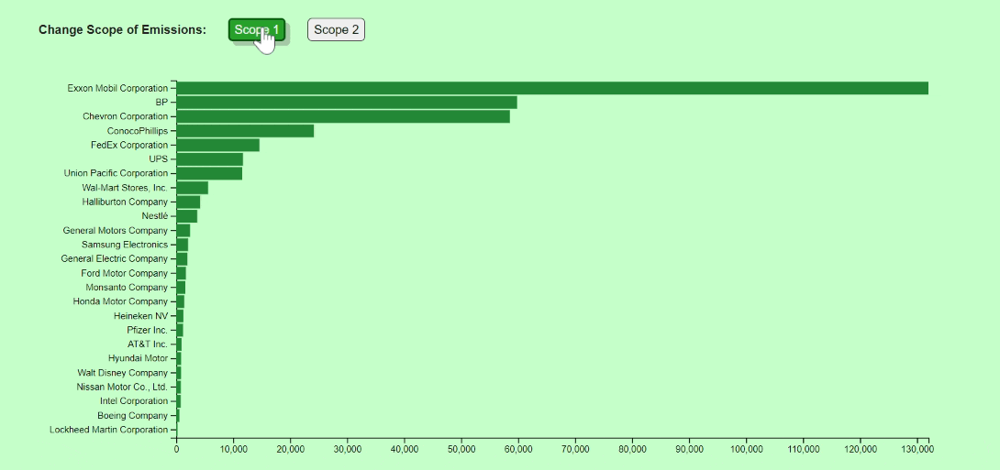

# global_500_emissions

This visualization can be viewed at the following link:  
[https://paul-schultz.github.io/global_500_emissions/](https://paul-schultz.github.io/global_500_emissions/)

To demonstrate the range in Scope 1 and Scope 2 emissions levels between a sampling of S&P 500 Companies I created this interactive bar chart using D3.js. The raw data was collected from the Carbon Disclosure Project's online data portal from a survey conducted in 2013.

For those that aren't familiar, the S&P 500 Index is a way to keep track of the performance of the 500 largest companies listed on stock exchanges. The companies included in the data set range from oil companies like BP or Exxon Mobil to large pharmaceutical and telecommunications companies. 

The EPA defines Scope 1 emissions as "direct emissions from sources that are owned or controlled by the Agency" and Scope 2 emissions as "indirect emissions from sources that are owned or controlled by the Agency." The visualization measures these emissions in 1000's of Metric Tonnes CO2e.

The data makes it evident that the range of Scope 1 emissions varies considerably among S&P 500. With a handful of companies doing significantly more polluting than those at the bottom. This is to be expected, as it makes sense that BP would emit more pollutants than a technology company like Intel. 

On the contrary, Scope 2 emissions created a graph that was much lower in scale, and much less varied by company. In the Scope 2 visualization companies like Wal-Mart and AT&T create the most pollution. This could be because of the overhead related to running those businesses, electricity to keep the lights on at the stores and to operate cell towers.

To switch between Scope 1 & 2 emissions levels you just click the corresponding button like this: 
  